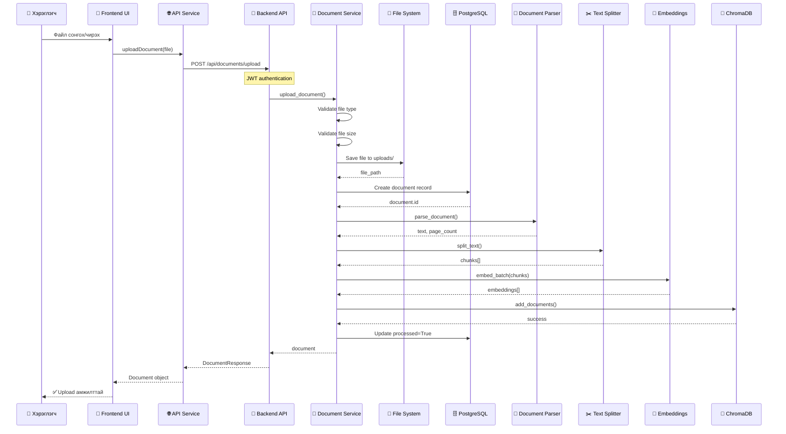

# Aero-Doc-AI: File Upload Flow Тайлбар

Энэ баримт нь таны Aero-Doc-AI системийн файл upload хийх үйл явцыг frontend-ээс эхлээд backend хүртэл, мөн хадгалалтын механизмыг дэлгэрэнгүй тайлбарлана.

---

## 📋 Ерөнхий Тойм

Файл upload-ын үйл явц нь дараах үе шатуудаас бүрдэнэ:

1. **Frontend**: Хэрэглэгч файл сонгох/чирэх
2. **API Request**: FormData ашиглан backend руу илгээх
3. **Backend Validation**: Файлын төрөл, хэмжээ шалгах
4. **File Storage**: Файлыг дискэнд хадгалах
5. **Database Record**: Мэдээллийг PostgreSQL-д бичих
6. **Document Processing**: Текст задлах, chunk хийх, embedding үүсгэх
7. **Vector Storage**: ChromaDB-д vector embeddings хадгалах

---

## 🎨 Frontend: Файл Upload UI

### Байршил
[DocumentUpload.tsx](file:///Users/soonko/Documents/Dentsv/Aero-Doc-AI/frontend/src/components/Documents/DocumentUpload.tsx)

### Үндсэн Функцууд

#### 1. Drag & Drop Интерфэйс
```typescript
// react-dropzone ашиглан drag & drop дэмжлэг
const { getRootProps, getInputProps, isDragActive } = useDropzone({
    onDrop,
    accept: {
        'application/pdf': ['.pdf'],
        'application/vnd.openxmlformats-officedocument.wordprocessingml.document': ['.docx'],
        'application/msword': ['.doc'],
    },
    maxFiles: 1,
    disabled: uploading,
});
```

**Зөвшөөрөгдсөн файлын төрлүүд:**
- PDF (`.pdf`)
- Word документ (`.docx`, `.doc`)

**Хязгаарлалт:**
- Нэг удаад 1 файл
- Максимум хэмжээ: 10MB

#### 2. Upload Функц
```typescript
const onDrop = useCallback(async (acceptedFiles: File[]) => {
    const file = acceptedFiles[0];
    if (!file) return;

    setUploading(true);
    setError(null);

    try {
        // Backend API дуудах
        await documentService.uploadDocument(file);
        onUploadSuccess();
    } catch (err: any) {
        setError(err.response?.data?.detail || 'Upload failed');
    } finally {
        setUploading(false);
    }
}, [onUploadSuccess]);
```

---

## 🌐 API Layer: Frontend Service

### Байршил
[documents.ts](file:///Users/soonko/Documents/Dentsv/Aero-Doc-AI/frontend/src/services/documents.ts)

### Upload Request
```typescript
async uploadDocument(file: File): Promise<Document> {
    const formData = new FormData();
    formData.append('file', file);

    const response = await api.post<Document>('/documents/upload', formData, {
        headers: {
            'Content-Type': 'multipart/form-data',
        },
    });
    return response.data;
}
```

**Тайлбар:**
- `FormData` объект үүсгэж файлыг хавсаргана
- `multipart/form-data` Content-Type ашиглана
- JWT token автоматаар `api` instance-аар нэмэгдэнэ
- `/api/documents/upload` endpoint руу POST request илгээнэ

---

## 🔧 Backend: API Endpoint

### Байршил
[documents.py](file:///Users/soonko/Documents/Dentsv/Aero-Doc-AI/backend/app/routers/documents.py)

### Upload Endpoint
```python
@router.post("/upload", response_model=DocumentResponse)
async def upload_document(
    file: UploadFile = File(...),
    current_user: User = Depends(get_current_user),
    db: Session = Depends(get_db)
):
    """
    Upload and process a document (PDF or DOCX).
    The file will be stored, text extracted, chunked, and embedded into ChromaDB.
    """
    return await document_service.upload_document(db, current_user, file)
```

**Параметрүүд:**
- `file`: FastAPI-н `UploadFile` объект
- `current_user`: JWT token-оос авсан хэрэглэгч
- `db`: Database session

---

## 💾 Backend: Document Service - Файл Хадгалалт

### Байршил
[document_service.py](file:///Users/soonko/Documents/Dentsv/Aero-Doc-AI/backend/app/services/document_service.py)

### 1. Файл Validation

```python
# Файлын төрөл шалгах
file_ext = os.path.splitext(file.filename)[1].lower()
if file_ext not in ['.pdf', '.docx', '.doc']:
    raise HTTPException(
        status_code=400,
        detail=f"Unsupported file type: {file_ext}"
    )

# Файлын хэмжээ шалгах
file.file.seek(0, 2)  # Төгсгөл рүү очих
file_size = file.file.tell()  # Хэмжээг авах
file.file.seek(0)  # Эхлэл рүү буцах

if file_size > settings.MAX_UPLOAD_SIZE:  # 10MB
    raise HTTPException(
        status_code=400,
        detail=f"File too large. Max size: {settings.MAX_UPLOAD_SIZE} bytes"
    )
```

### 2. Файл Дискэнд Хадгалах

```python
# Файлын зам үүсгэх: uploads/{user_id}_{filename}
file_path = os.path.join(settings.UPLOAD_DIR, f"{user.id}_{file.filename}")

# Файл хадгалах
with open(file_path, "wb") as buffer:
    shutil.copyfileobj(file.file, buffer)
```

**Хадгалах байршил:**
- Директор: `./uploads/` (backend-ын үндсэн директороос)
- Файлын нэр: `{user_id}_{original_filename}`
- Жишээ: `./uploads/123e4567-e89b-12d3-a456-426614174000_report.pdf`

### 3. Database-д Бичлэг Үүсгэх

```python
# Document model үүсгэх
document = Document(
    user_id=user.id,
    filename=file.filename,
    file_type=file_ext.replace('.', ''),  # 'pdf', 'docx'
    file_path=file_path,
    file_size=file_size,
    processed=False  # Эхэндээ боловсруулаагүй
)

db.add(document)
db.commit()
db.refresh(document)
```

---

## 🗄️ Database: Document Model

### Байршил
[document.py](file:///Users/soonko/Documents/Dentsv/Aero-Doc-AI/backend/app/models/document.py)

### Table Schema: `documents`

| Column | Type | Тайлбар |
|--------|------|---------|
| `id` | UUID | Primary key |
| `user_id` | UUID | Foreign key → users.id |
| `filename` | String(255) | Анхны файлын нэр |
| `file_type` | String(10) | 'pdf', 'docx' |
| `file_path` | Text | Дискэн дээрх бодит зам |
| `file_size` | Integer | Хэмжээ (bytes) |
| `upload_date` | DateTime | Upload хийсэн огноо |
| `processed` | Boolean | Боловсруулалт дууссан эсэх |
| `chunk_count` | Integer | Chunk-уудын тоо |
| `error_message` | Text | Алдааны мэдээлэл |

---

## 🤖 Document Processing Pipeline

### 1. Текст Задлах (Text Extraction)

```python
# DocumentParser ашиглан текст задлах
text, page_count = DocumentParser.parse_document(
    document.file_path,
    document.file_type
)
```

**Дэмжигдсэн форматууд:**
- PDF: PyPDF2 эсвэл pdfplumber ашиглана
- DOCX: python-docx ашиглана

### 2. Text Chunking

```python
# RecursiveCharacterTextSplitter ашиглан chunk хийх
text_splitter = RecursiveCharacterTextSplitter(
    chunk_size=1000,        # Chunk бүр 1000 тэмдэгт
    chunk_overlap=200,      # Chunk хоорондоо 200 тэмдэгт давхцана
    length_function=len,
    separators=["\n\n", "\n", " ", ""]
)

chunks = text_splitter.split_text(text)
```

**Chunk-ын параметрүүд:**
- **chunk_size**: 1000 тэмдэгт
- **chunk_overlap**: 200 тэмдэгт (контекст хадгалах)
- **separators**: Мөр, догол мөр, зай дараалалаар

### 3. Embedding Үүсгэх

```python
# HuggingFace model ашиглан embedding үүсгэх
embeddings = self.embeddings.embed_batch(chunks)
```

**Model**: `sentence-transformers/all-MiniLM-L6-v2`
- Локал дээр ажилладаг
- Хурдан, үнэгүй
- 384-dimension vector үүсгэнэ

### 4. Metadata Бэлтгэх

```python
metadatas = [
    {
        "doc_id": str(document.id),
        "filename": document.filename,
        "chunk_index": i,
        "total_chunks": len(chunks),
        "user_id": str(document.user_id)
    }
    for i in range(len(chunks))
]
```

### 5. Vector Database-д Хадгалах

```python
# ChromaDB-д хадгалах
self.vector_store.add_documents(
    doc_id=document.id,
    chunks=chunks,
    embeddings=embeddings,
    metadatas=metadatas
)
```

**ChromaDB Configuration:**
- Host: `localhost`
- Port: `8000`
- Collection: User-specific эсвэл global

### 6. Status Update

```python
# Амжилттай боловсруулсан бол
document.processed = True
document.chunk_count = len(chunks)
document.error_message = None
db.commit()
```

---

## 📊 Хадгалалтын Бүтэц

### 1. Файл Систем (Disk Storage)

```
backend/
└── uploads/
    ├── {user_id_1}_{filename_1}.pdf
    ├── {user_id_1}_{filename_2}.docx
    ├── {user_id_2}_{filename_1}.pdf
    └── ...
```

**Онцлог:**
- Бодит файлууд дискэнд хадгалагдана
- User ID-аар prefix хийж давхцал үүсэхээс сэргийлнэ
- Файл устгахад дискээс бас устгана

### 2. PostgreSQL Database

```sql
-- documents table
CREATE TABLE documents (
    id UUID PRIMARY KEY,
    user_id UUID REFERENCES users(id) ON DELETE CASCADE,
    filename VARCHAR(255),
    file_type VARCHAR(10),
    file_path TEXT,
    file_size INTEGER,
    upload_date TIMESTAMP WITH TIME ZONE DEFAULT NOW(),
    processed BOOLEAN DEFAULT FALSE,
    chunk_count INTEGER DEFAULT 0,
    error_message TEXT
);
```

**Хадгалагдах мэдээлэл:**
- Файлын metadata (нэр, хэмжээ, төрөл)
- Дискэн дээрх зам
- Боловсруулалтын статус
- Chunk-ын тоо

### 3. ChromaDB (Vector Store)

```python
# Chunk бүрд:
{
    "id": "unique_chunk_id",
    "embedding": [0.123, -0.456, ...],  # 384-dimension vector
    "document": "chunk text content",
    "metadata": {
        "doc_id": "document_uuid",
        "filename": "report.pdf",
        "chunk_index": 0,
        "total_chunks": 15,
        "user_id": "user_uuid"
    }
}
```

**Хадгалагдах мэдээлэл:**
- Текстийн chunk
- Vector embedding (384-dimension)
- Metadata (doc_id, chunk_index, гэх мэт)

---

## 🔄 Бүтэн Үйл Явцын Диаграмм



---

## 🔍 Файл Устгах Үйл Явц

```python
def delete_document(self, db: Session, doc_id: UUID, user_id: UUID):
    """Delete document and its vectors"""
    document = self.get_document_by_id(db, doc_id, user_id)
    
    # 1. ChromaDB-с vector устгах
    self.vector_store.delete_document(doc_id)
    
    # 2. Дискээс файл устгах
    if os.path.exists(document.file_path):
        os.remove(document.file_path)
    
    # 3. Database-с бичлэг устгах
    db.delete(document)
    db.commit()
```

**Устгах дараалал:**
1. Vector embeddings (ChromaDB)
2. Бодит файл (File System)
3. Database бичлэг (PostgreSQL)

---

## ⚙️ Configuration

### Байршил
[config.py](file:///Users/soonko/Documents/Dentsv/Aero-Doc-AI/backend/app/config.py)

### Файл Upload Тохиргоо

```python
# File Upload
MAX_UPLOAD_SIZE: int = 10 * 1024 * 1024  # 10MB
ALLOWED_EXTENSIONS: List[str] = [".pdf", ".docx"]
UPLOAD_DIR: str = "./uploads"

# RAG Configuration
CHUNK_SIZE: int = 1000
CHUNK_OVERLAP: int = 200
TOP_K_RESULTS: int = 5

# LLM Configuration
EMBEDDING_MODEL: str = "sentence-transformers/all-MiniLM-L6-v2"
```

---

## 🛡️ Аюулгүй Байдал (Security)

### 1. Authentication
- JWT token шаардлагатай
- `get_current_user` dependency ашиглана

### 2. File Validation
- Файлын төрөл шалгах (зөвхөн PDF, DOCX)
- Файлын хэмжээ хязгаарлах (10MB)

### 3. User Isolation
- Файлууд user_id-аар prefix хийгдэнэ
- Хэрэглэгч зөвхөн өөрийн файлуудыг харна/устгана
- Database query-д user_id шалгалт байна

### 4. Error Handling
- Validation алдаа → 400 Bad Request
- Processing алдаа → error_message-д хадгална
- File system алдаа → try/catch блок

---

## 📝 Хураангуй

### Хадгалалтын 3 Давхарга

1. **File System** (`./uploads/`)
   - Бодит файлууд
   - User ID prefix
   - Дискэн дээр хадгална

2. **PostgreSQL** (`documents` table)
   - Metadata
   - File path
   - Processing status

3. **ChromaDB** (Vector database)
   - Text chunks
   - Embeddings (384-dim vectors)
   - Metadata

### Үйл Явцын Урсгал

```
Upload → Validate → Save to Disk → DB Record → 
Parse Text → Chunk → Embed → Vector Store → Update Status
```

### Давуу Тал

✅ Гурван давхарга хадгалалт (redundancy)  
✅ Хэрэглэгчийн тусгаарлалт  
✅ Бүрэн validation  
✅ Error handling  
✅ RAG-д бэлэн (vector search)  
✅ Metadata tracking  

---

## 🔗 Холбоотой Файлууд

### Frontend
- [DocumentUpload.tsx](file:///Users/soonko/Documents/Dentsv/Aero-Doc-AI/frontend/src/components/Documents/DocumentUpload.tsx) - Upload UI
- [documents.ts](file:///Users/soonko/Documents/Dentsv/Aero-Doc-AI/frontend/src/services/documents.ts) - API service

### Backend
- [documents.py](file:///Users/soonko/Documents/Dentsv/Aero-Doc-AI/backend/app/routers/documents.py) - API endpoints
- [document_service.py](file:///Users/soonko/Documents/Dentsv/Aero-Doc-AI/backend/app/services/document_service.py) - Business logic
- [document.py](file:///Users/soonko/Documents/Dentsv/Aero-Doc-AI/backend/app/models/document.py) - Database model
- [config.py](file:///Users/soonko/Documents/Dentsv/Aero-Doc-AI/backend/app/config.py) - Configuration

---

Энэ баримт нь таны Aero-Doc-AI системийн файл upload болон хадгалалтын бүрэн үйл явцыг тайлбарласан болно. Нэмэлт асуулт байвал асуугаарай! 🚀
