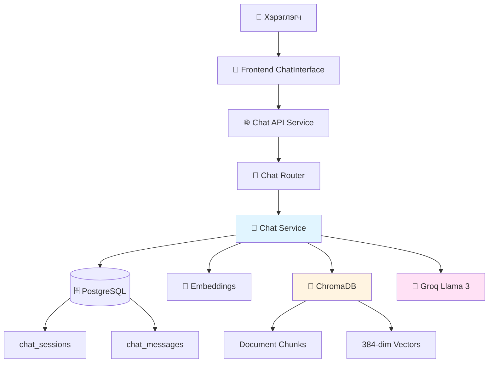
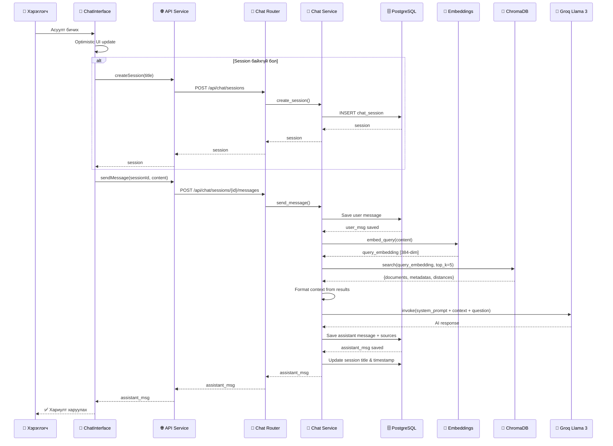

# Aero-Doc-AI: Chat Logic & RAG Pipeline Тайлбар

Энэ баримт нь таны Aero-Doc-AI системийн чат logic болон RAG (Retrieval-Augmented Generation) pipeline-ийн үйл явцыг frontend-ээс эхлээд backend, vector database хүртэл дэлгэрэнгүй тайлбарлана.

---

## 📋 Ерөнхий Тойм

Chat систем нь **RAG (Retrieval-Augmented Generation)** технологи ашигладаг. Энэ нь:

1. **Хэрэглэгчийн асуулт** → Embedding болгох
2. **Vector Search** → ChromaDB-с холбогдох баримтын хэсгүүдийг олох
3. **Context Preparation** → Олдсон мэдээллийг нэгтгэх
4. **LLM Generation** → Groq (Llama 3) ашиглан хариулт үүсгэх
5. **Response Storage** → Хариултыг database-д хадгалах

---

## 🏗 Системийн Архитектур



---

## 🗄️ Database Schema

### 1. `chat_sessions` Table

```sql
CREATE TABLE chat_sessions (
    id UUID PRIMARY KEY DEFAULT gen_random_uuid(),
    user_id UUID REFERENCES users(id) ON DELETE CASCADE,
    title VARCHAR(255) DEFAULT 'New Chat',
    created_at TIMESTAMP WITH TIME ZONE DEFAULT NOW(),
    updated_at TIMESTAMP WITH TIME ZONE DEFAULT NOW()
);
```

**Хадгалагдах мэдээлэл:**
- Session ID
- Хэрэглэгч
- Чатын гарчиг (эхний асуултаас үүсгэнэ)
- Үүсгэсэн/Шинэчилсэн огноо

### 2. `chat_messages` Table

```sql
CREATE TABLE chat_messages (
    id UUID PRIMARY KEY DEFAULT gen_random_uuid(),
    session_id UUID REFERENCES chat_sessions(id) ON DELETE CASCADE,
    role VARCHAR(20) NOT NULL,  -- 'user' or 'assistant'
    content TEXT NOT NULL,
    sources JSONB,  -- Retrieved document chunks
    created_at TIMESTAMP WITH TIME ZONE DEFAULT NOW()
);
```

**Хадгалагдах мэдээлэл:**
- Message ID
- Session ID
- Role: `user` (хэрэглэгч) эсвэл `assistant` (AI)
- Content: Мессежийн агуулга
- Sources: Олдсон баримтын эх сурвалжууд (JSONB format)

**Sources JSONB Format:**
```json
[
  {
    "doc_id": "uuid",
    "filename": "manual.pdf",
    "chunk_index": 0,
    "page_number": 1
  }
]
```

---

## 🔄 Бүтэн Chat Flow

### Sequence Diagram



---

## 📱 Frontend: Chat Interface

### Байршил
[ChatInterface.tsx](file:///Users/soonko/Documents/Dentsv/Aero-Doc-AI/frontend/src/components/Chat/ChatInterface.tsx)

### Үндсэн Функцууд

#### 1. Message Submit Handler

```typescript
const handleSubmit = async (e: React.FormEvent) => {
    e.preventDefault();
    if (!input.trim() || isLoading) return;

    const content = input.trim();
    setInput('');

    // Optimistic UI update - хэрэглэгчийн мессежийг шууд харуулах
    const optimisticMessage: Message = {
        id: 'temp-' + Date.now(),
        session_id: session?.id || '',
        role: 'user',
        content: content,
        created_at: new Date().toISOString(),
    };

    setMessages(prev => [...prev, optimisticMessage]);
    setIsLoading(true);

    try {
        let currentSessionId = session?.id;

        // Session байхгүй бол шинээр үүсгэх
        if (!currentSessionId) {
            const title = content.slice(0, 30) + '...';
            const newSession = await chatService.createSession(title);
            currentSessionId = newSession.id;
            if (onSessionCreated) onSessionCreated(newSession);
        }

        // Мессеж илгээх
        const response = await chatService.sendMessage(currentSessionId, content);
        
        // AI хариултыг нэмэх
        setMessages(prev => [...prev, response]);

    } catch (error) {
        console.error('Failed to send message', error);
        alert('Failed to send message. Please try again.');
    } finally {
        setIsLoading(false);
    }
};
```

**Онцлог:**
- **Optimistic UI**: Хэрэглэгчийн мессежийг backend хариулахыг хүлээхгүйгээр шууд харуулна
- **Auto Session Creation**: Session байхгүй бол автоматаар үүсгэнэ
- **Auto Scroll**: Шинэ мессеж ирэх бүрд доош scroll хийнэ

---

## 🌐 API Layer: Frontend Service

### Байршил
[chat.ts](file:///Users/soonko/Documents/Dentsv/Aero-Doc-AI/frontend/src/services/chat.ts)

### API Functions

```typescript
export const chatService = {
    // 1. Шинэ session үүсгэх
    async createSession(title: string): Promise<ChatSession> {
        const response = await api.post<ChatSession>('/chat/sessions', { title });
        return response.data;
    },

    // 2. Бүх session-уудыг авах
    async getSessions(): Promise<ChatSessionListResponse> {
        const response = await api.get<ChatSessionListResponse>('/chat/sessions');
        return response.data;
    },

    // 3. Session-ий түүхийг авах
    async getSessionHistory(sessionId: string): Promise<ChatHistoryResponse> {
        const response = await api.get<ChatHistoryResponse>(`/chat/sessions/${sessionId}`);
        return response.data;
    },

    // 4. Мессеж илгээх
    async sendMessage(sessionId: string, content: string): Promise<Message> {
        const response = await api.post<Message>(`/chat/sessions/${sessionId}/messages`, {
            session_id: sessionId,
            content,
        });
        return response.data;
    },
};
```

---

## 🔧 Backend: Chat Router

### Байршил
[chat.py](file:///Users/soonko/Documents/Dentsv/Aero-Doc-AI/backend/app/routers/chat.py)

### API Endpoints

#### 1. Create Session
```python
@router.post("/sessions", response_model=ChatSessionResponse)
async def create_chat_session(
    session_data: ChatSessionCreate,
    current_user: User = Depends(get_current_user),
    db: Session = Depends(get_db)
):
    """Create a new chat session"""
    return chat_service.create_session(db, current_user, session_data.title)
```

#### 2. Get Sessions
```python
@router.get("/sessions", response_model=ChatSessionListResponse)
async def get_chat_sessions(
    current_user: User = Depends(get_current_user),
    db: Session = Depends(get_db)
):
    """List all chat sessions for the current user"""
    sessions = chat_service.get_user_sessions(db, current_user)
    return ChatSessionListResponse(sessions=sessions, total=len(sessions))
```

#### 3. Get Session History
```python
@router.get("/sessions/{session_id}", response_model=ChatHistoryResponse)
async def get_chat_history(
    session_id: UUID,
    current_user: User = Depends(get_current_user),
    db: Session = Depends(get_db)
):
    """Get chat history for a specific session"""
    session = chat_service.get_session(db, session_id, current_user.id)
    return ChatHistoryResponse(session=session, messages=session.messages)
```

#### 4. Send Message (RAG)
```python
@router.post("/sessions/{session_id}/messages", response_model=ChatMessageResponse)
async def send_message(
    session_id: UUID,
    message_data: ChatMessageRequest,
    current_user: User = Depends(get_current_user),
    db: Session = Depends(get_db)
):
    """Send a message to a chat session (RAG)"""
    return await chat_service.send_message(
        db, 
        current_user.id, 
        session_id, 
        message_data.content
    )
```

---

## 💼 Backend: Chat Service (RAG Logic)

### Байршил
[chat_service.py](file:///Users/soonko/Documents/Dentsv/Aero-Doc-AI/backend/app/services/chat_service.py)

### Initialization

```python
class ChatService:
    def __init__(self):
        # Vector store (ChromaDB)
        self.vector_store = VectorStore()
        
        # Embeddings (HuggingFace local)
        self.embeddings = GeminiEmbeddings()
        
        # LLM (Groq Llama 3)
        self.llm = ChatGroq(
            model=settings.LLM_MODEL,  # "llama-3.3-70b-versatile"
            api_key=settings.GROQ_API_KEY,
            temperature=0.7
        )
        
        # System prompt template
        self.system_prompt = """You are Aero-Doc AI, an intelligent assistant...
        Context:
        {context}
        """
```

### RAG Pipeline: `send_message()`

Энэ функц нь чатын үндсэн logic юм. 7 үе шаттай:

#### **Шат 1: Session Validation**

```python
# Session байгаа эсэхийг шалгах
session = self.get_session(db, session_id, user_id)
```

#### **Шат 2: Save User Message**

```python
# Хэрэглэгчийн мессежийг database-д хадгалах
user_msg = ChatMessage(
    session_id=session_id,
    role="user",
    content=content
)
db.add(user_msg)
db.commit()
```

#### **Шат 3: Query Embedding**

```python
# Асуултыг 384-dimension vector болгох
query_embedding = self.embeddings.embed_query(content)
# Result: [0.123, -0.456, 0.789, ...] (384 тоо)
```

**Model**: `sentence-transformers/all-MiniLM-L6-v2`
- Локал дээр ажилладаг
- Хурдан (CPU дээр ч сайн)
- 384-dimension output

#### **Шат 4: Vector Similarity Search**

```python
# ChromaDB-с хамгийн ойролцоо 5 chunk-г олох
search_results = self.vector_store.search(
    query_embedding=query_embedding,
    top_k=5  # Дээд тал нь 5 үр дүн
)
```

**ChromaDB Search:**
- Cosine similarity ашиглана
- Top-5 хамгийн ойролцоо chunk-уудыг буцаана
- Metadata (filename, chunk_index, гэх мэт) бас ирнэ

**Search Results Format:**
```python
{
    "ids": ["doc1_0", "doc1_5", "doc2_3", ...],
    "documents": ["chunk text 1", "chunk text 2", ...],
    "metadatas": [
        {"doc_id": "uuid1", "filename": "manual.pdf", "chunk_index": 0},
        {"doc_id": "uuid1", "filename": "manual.pdf", "chunk_index": 5},
        ...
    ],
    "distances": [0.12, 0.18, 0.25, ...]  # Бага = ойр
}
```

#### **Шат 5: Context Preparation**

```python
# Олдсон chunk-уудыг нэгтгэх
context_parts = []
sources = []

docs = search_results.get("documents", [])
metas = search_results.get("metadatas", [])

for i, doc_text in enumerate(docs):
    meta = metas[i] if i < len(metas) else {}
    filename = meta.get("filename", "Unknown")
    
    # Context string үүсгэх
    context_parts.append(f"Source: {filename}\nContent: {doc_text}")
    
    # Source metadata хадгалах
    source_entry = {
        "doc_id": meta.get("doc_id"),
        "filename": filename,
        "chunk_index": meta.get("chunk_index"),
        "page_number": meta.get("page_number")
    }
    if source_entry not in sources:
        sources.append(source_entry)

# Бүх context-ийг нэгтгэх
context_str = "\n\n".join(context_parts)
```

**Context Example:**
```
Source: installation_manual.pdf
Content: To install the software, first ensure that you have...

Source: user_guide.pdf
Content: The main dashboard provides access to all features...

Source: installation_manual.pdf
Content: System requirements include Python 3.8 or higher...
```

#### **Шат 6: LLM Response Generation**

```python
# Prompt бэлтгэх
messages = [
    SystemMessage(content=self.system_prompt.format(context=context_str)),
    HumanMessage(content=content)
]

# Groq API дуудах (Llama 3)
response = self.llm.invoke(messages)
answer_text = response.content
```

**LLM Configuration:**
- **Model**: `llama-3.3-70b-versatile`
- **Temperature**: 0.7 (креатив боловч хяналттай)
- **Provider**: Groq (маш хурдан inference)

**System Prompt:**
```
You are Aero-Doc AI, an intelligent assistant designed to help users 
understand their technical documents.

Use the following pieces of retrieved context to answer the user's question.

Guidelines:
1. Base your answer ONLY on the provided context.
2. If the answer is not in the context, say "I cannot find the answer..."
3. Cite the source document filenames when possible.
4. Keep answers concise and professional.

Context:
[олдсон chunk-ууд энд орно]
```

#### **Шат 7: Save Assistant Response**

```python
# AI хариултыг database-д хадгалах
assistant_msg = ChatMessage(
    session_id=session_id,
    role="assistant",
    content=answer_text,
    sources=sources  # JSONB format
)
db.add(assistant_msg)

# Session title шинэчлэх (хэрэв "New Chat" бол)
if session.title == "New Chat":
    session.title = content[:30] + "..."

db.commit()
db.refresh(assistant_msg)

return assistant_msg
```

---

## 🔢 Vector Store Service

### Байршил
[vector_store.py](file:///Users/soonko/Documents/Dentsv/Aero-Doc-AI/backend/app/services/vector_store.py)

### ChromaDB Configuration

```python
class VectorStore:
    def __init__(self):
        # ChromaDB client
        self.client = chromadb.HttpClient(
            host=settings.CHROMA_HOST,  # "localhost"
            port=settings.CHROMA_PORT,  # 8000
            settings=Settings(anonymized_telemetry=False)
        )
        
        # Collection үүсгэх/авах
        self.collection_name = "technical_documents"
        self.collection = self._get_or_create_collection()
```

### Vector Search

```python
def search(
    self,
    query_embedding: List[float],
    top_k: int = 5,
    filter_metadata: Optional[Dict[str, Any]] = None
) -> Dict[str, Any]:
    """
    Similarity search using cosine distance
    """
    results = self.collection.query(
        query_embeddings=[query_embedding],
        n_results=top_k,
        where=filter_metadata  # Optional filter (e.g., user_id)
    )
    
    return {
        "ids": results['ids'][0] if results['ids'] else [],
        "documents": results['documents'][0] if results['documents'] else [],
        "metadatas": results['metadatas'][0] if results['metadatas'] else [],
        "distances": results['distances'][0] if results['distances'] else []
    }
```

**Cosine Similarity:**
- 0.0 = Яг ижил
- 1.0 = Огт өөр
- Бага утга = Илүү ойролцоо

---

## 🤖 Embeddings Service

### Байршил
[embeddings.py](file:///Users/soonko/Documents/Dentsv/Aero-Doc-AI/backend/app/utils/embeddings.py)

### HuggingFace Local Embeddings

```python
from langchain_huggingface import HuggingFaceEmbeddings

class GeminiEmbeddings:  # Нэр нь хуучин, харин HuggingFace ашиглаж байна
    def __init__(self):
        self.embeddings = HuggingFaceEmbeddings(
            model_name="sentence-transformers/all-MiniLM-L6-v2"
        )
    
    def embed_query(self, text: str) -> List[float]:
        """Single query embedding"""
        return self.embeddings.embed_query(text)
    
    def embed_batch(self, texts: List[str]) -> List[List[float]]:
        """Batch embedding for multiple texts"""
        return self.embeddings.embed_documents(texts)
```

**Model Specs:**
- **Name**: `sentence-transformers/all-MiniLM-L6-v2`
- **Dimension**: 384
- **Speed**: Маш хурдан (CPU дээр ч сайн)
- **Quality**: Ерөнхий зориулалтын semantic search-д тохиромжтой

---

## 📊 Бүтэн Үйл Явцын Жишээ

### Хэрэглэгчийн Асуулт
```
"How do I install the software?"
```

### 1. Query Embedding
```python
query_embedding = [0.123, -0.456, 0.789, ..., 0.234]  # 384 тоо
```

### 2. Vector Search Results
```python
{
    "documents": [
        "To install the software, first ensure Python 3.8+ is installed...",
        "Installation steps: 1. Download the installer 2. Run setup.exe...",
        "System requirements: Windows 10, 4GB RAM, 2GB disk space..."
    ],
    "metadatas": [
        {"filename": "installation_guide.pdf", "chunk_index": 0},
        {"filename": "quick_start.pdf", "chunk_index": 2},
        {"filename": "installation_guide.pdf", "chunk_index": 5}
    ],
    "distances": [0.15, 0.22, 0.28]
}
```

### 3. Context Prepared
```
Source: installation_guide.pdf
Content: To install the software, first ensure Python 3.8+ is installed...

Source: quick_start.pdf
Content: Installation steps: 1. Download the installer 2. Run setup.exe...

Source: installation_guide.pdf
Content: System requirements: Windows 10, 4GB RAM, 2GB disk space...
```

### 4. LLM Prompt
```
System: You are Aero-Doc AI...
Context: [дээрх context]

User: How do I install the software?
```

### 5. AI Response
```
To install the software, follow these steps:

1. Ensure you have Python 3.8 or higher installed on your system
2. Download the installer from the official website
3. Run setup.exe and follow the installation wizard
4. Verify system requirements: Windows 10, 4GB RAM, 2GB disk space

Source: installation_guide.pdf, quick_start.pdf
```

### 6. Saved to Database
```sql
-- User message
INSERT INTO chat_messages (session_id, role, content) 
VALUES ('session-uuid', 'user', 'How do I install the software?');

-- Assistant message
INSERT INTO chat_messages (session_id, role, content, sources) 
VALUES (
    'session-uuid', 
    'assistant', 
    'To install the software, follow these steps...',
    '[{"filename": "installation_guide.pdf", ...}, ...]'::jsonb
);
```

---

## 🎯 RAG Pipeline-ын Давуу Тал

### 1. **Context-Aware Answers**
- Зөвхөн upload хийсэн баримтаас хариулна
- Хуурамч мэдээлэл үүсгэхгүй

### 2. **Source Citation**
- Хариулт бүр эх сурвалжтай
- Хэрэглэгч баримт руу очиж шалгаж болно

### 3. **Fast & Free**
- Groq: Дэлхийн хамгийн хурдан LLM inference
- Local embeddings: API зардал байхгүй
- ChromaDB: Үнэгүй vector database

### 4. **Privacy**
- Бүх embedding локал дээр үүснэ
- Зөвхөн LLM generation-д Groq API ашиглана
- Баримтууд таны сервер дээр хадгалагдана

---

## 🔒 Аюулгүй Байдал

### 1. Authentication
- JWT token шаардлагатай
- `get_current_user` dependency

### 2. User Isolation
- Session болон message бүр user_id-тай холбогдоно
- Хэрэглэгч зөвхөн өөрийн чатыг харна

### 3. Input Validation
- Pydantic schemas ашиглана
- SQL injection prevention (SQLAlchemy ORM)

### 4. Error Handling
```python
try:
    # RAG pipeline
    ...
except Exception as e:
    # Error message хадгалах
    assistant_msg = ChatMessage(
        session_id=session_id,
        role="assistant",
        content="I encountered an error...",
        sources=[{"error": str(e)}]
    )
    db.add(assistant_msg)
    db.commit()
    raise HTTPException(status_code=500, detail=error_msg)
```

---

## ⚙️ Configuration

### Backend Config
[config.py](file:///Users/soonko/Documents/Dentsv/Aero-Doc-AI/backend/app/config.py)

```python
# RAG Configuration
CHUNK_SIZE: int = 1000
CHUNK_OVERLAP: int = 200
TOP_K_RESULTS: int = 5

# LLM Configuration
LLM_MODEL: str = "llama-3.3-70b-versatile"
EMBEDDING_MODEL: str = "sentence-transformers/all-MiniLM-L6-v2"
LLM_TEMPERATURE: float = 0.7
MAX_OUTPUT_TOKENS: int = 2048

# ChromaDB
CHROMA_HOST: str = "localhost"
CHROMA_PORT: int = 8000
```

---

## 📝 Хураангуй

### Chat Flow (7 Шат)

```
1. User Message → Database
2. Query → Embedding (384-dim vector)
3. Vector Search → ChromaDB (top-5 chunks)
4. Context Preparation → Format results
5. LLM Prompt → System + Context + Question
6. Groq API → Generate answer
7. Assistant Message → Database (with sources)
```

### Технологийн Stack

| Компонент | Технологи | Үүрэг |
|-----------|-----------|-------|
| **Frontend** | React/Next.js | Chat UI, optimistic updates |
| **API** | FastAPI | REST endpoints, JWT auth |
| **Database** | PostgreSQL | Sessions, messages storage |
| **Embeddings** | HuggingFace (local) | Text → 384-dim vectors |
| **Vector DB** | ChromaDB | Similarity search |
| **LLM** | Groq (Llama 3) | Answer generation |

### Давуу Талууд

✅ **Хурдан**: Groq-ийн LPU технологи  
✅ **Үнэгүй**: Local embeddings, ChromaDB  
✅ **Нарийвчлалтай**: Context-based answers  
✅ **Эх сурвалжтай**: Source citation  
✅ **Аюулгүй**: User isolation, JWT auth  
✅ **Масштаблагдах**: Vector DB, async processing  

---
